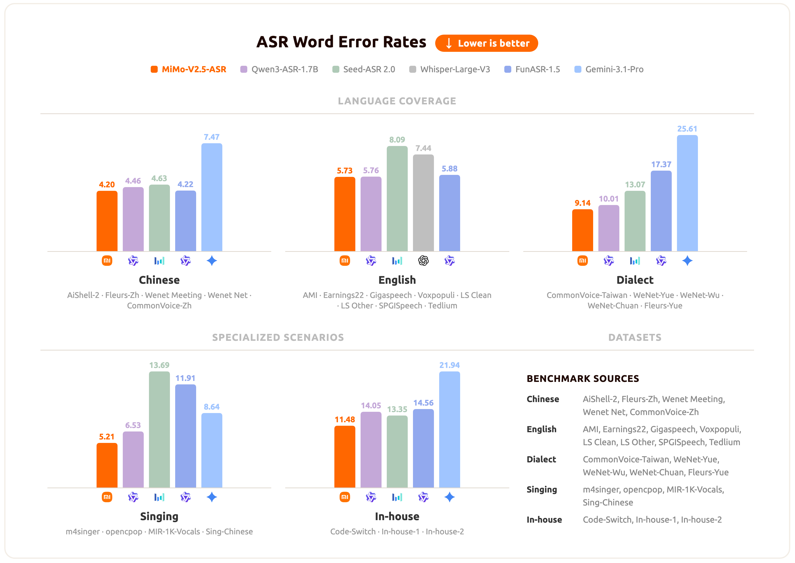

<div align="center">
  
</div>

<div align="center">
  <h3>
    <b>
      <span>━━━━━━━━━━━━━━━━━━━━━━━━━━━━━━━</span><br/>
      MiMo-V2.5-ASR: Robust Speech Recognition Across<br/>
      Languages, Dialects, and Complex Acoustic Scenarios<br/>
      <span>━━━━━━━━━━━━━━━━━━━━━━━━━━━━━━━</span>
    </b>
  </h3>
</div>

<br/>

<div align="center" style="line-height: 1;">
  |
  <a href="https://huggingface.co/XiaomiMiMo/MiMo-V2.5-ASR" target="_blank">🤗 HuggingFace</a>
  &nbsp;|
  <a href="https://huggingface.co/spaces/XiaomiMiMo/MiMo-V2.5-ASR" target="_blank">🚀 Online Demo</a>
  &nbsp;|
  <a href="https://mimo.xiaomi.com/mimo-v2-5-asr" target="_blank">📰 Blog</a>
  &nbsp;|

  <br/>
</div>

<br/>

## Introduction

**MiMo-V2.5-ASR** is a state-of-the-art end-to-end automatic speech recognition (ASR) model developed by the Xiaomi MiMo team. It is built to deliver accurate and robust transcription across Mandarin Chinese and English, multiple Chinese dialects, code-switched speech, song lyrics, knowledge-intensive content, noisy acoustic environments, and multi-speaker conversations. MiMo-V2.5-ASR achieves state-of-the-art results on a wide range of public benchmarks.

## Abstract

Automatic speech recognition systems are expected to faithfully transcribe speech signals that originate from diverse languages, dialects, accents, and domains, and that are captured under a wide variety of acoustic conditions. While conventional end-to-end models perform well on in-domain data, they still fall short of real-world requirements in challenging scenarios such as dialect mixing, code-switching, knowledge-intensive content, noisy environments, and multi-speaker conversations. Therefore, we present **MiMo-V2.5-ASR**, an end-to-end speech recognition model developed by the Xiaomi MiMo team. Through large-scale mid-training, high-quality supervised fine-tuning, and a novel reinforcement-learning algorithm, MiMo-V2.5-ASR achieves systematic improvements along the following dimensions:

- 🗣️ **Chinese Dialects**: Native support for Wu, Cantonese, Hokkien, Sichuanese, and more.
- 🔀 **Code-Switch**: Seamless Chinese–English code-switching transcription with no language tags required.
- 🎵 **Song Recognition**: High-precision lyrics transcription for Chinese and English songs, even with mixed accompaniment and vocals.
- 🔊 **Noisy Environments**: Robust recognition under heavy noise, far-field capture, and other adverse acoustic conditions.
- 👥 **Multi-Speaker**: Accurate transcription of overlapping, multi-party conversations such as meetings.
- 🇬🇧 **Complex English Scenarios**: Leading performance on the Open ASR Leaderboard for challenging English benchmarks such as AMI.
- 📚 **Knowledge-Intensive Recognition**: Precise recognition of classical poetry, technical terminology, personal names, place names, and other knowledge-dense material.
- 📝 **Native Punctuation**: Punctuation generated natively from prosody and semantics, delivering ready-to-use transcripts with no post-processing needed.

## Results

MiMo-V2.5-ASR has been evaluated across a broad set of benchmarks spanning standard Mandarin and English, Chinese dialects, lyric recognition, and internal business scenarios. The chart below summarizes the average performance of MiMo-V2.5-ASR across these scenarios.



For per-benchmark numbers and specific qualitative cases, please refer to our [blog](https://mimo.xiaomi.com/mimo-v2-5-asr).

## Model Download

| Models   | 🤗 Hugging Face |
|-------|-------|
| MiMo-Audio-Tokenizer | [XiaomiMiMo/MiMo-Audio-Tokenizer](https://huggingface.co/XiaomiMiMo/MiMo-Audio-Tokenizer) |
| MiMo-V2.5-ASR | [XiaomiMiMo/MiMo-V2.5-ASR](https://huggingface.co/XiaomiMiMo/MiMo-V2.5-ASR) |

```bash
pip install huggingface-hub

hf download XiaomiMiMo/MiMo-Audio-Tokenizer --local-dir ./model/MiMo-Audio-Tokenizer
hf download XiaomiMiMo/MiMo-V2.5-ASR --local-dir ./model/MiMo-V2.5-ASR
```

## Demo And API Usage

The original command-line demo and Python API notes have been moved to
[demo.md](demo.md).

## Citation

```bibtex
@misc{coreteam2026mimov25asr,
      title={MiMo-V2.5-ASR: Robust Speech Recognition Across Languages, Dialects, and Complex Acoustic Scenarios},
      author={LLM-Core-Team Xiaomi},
      year={2026},
      url={https://github.com/XiaomiMiMo/MiMo-V2.5-ASR},
}
```

## Contact

Please contact us at [mimo@xiaomi.com](mailto:mimo@xiaomi.com) or open an issue if you have any questions.
